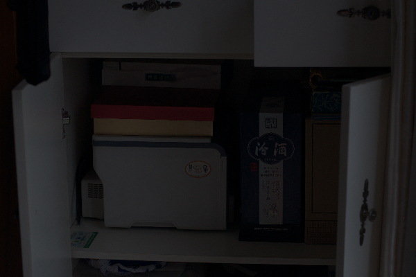
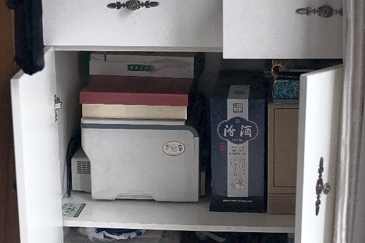

# Low-Light Image Enhancement

This project focuses on enhancing low-light images using various preprocessing,
enhancement, and postprocessing techniques. The system automatically detects
low-light conditions and applies a series of adjustments to improve image
quality.

## Features

- **Automatic Low-Light Detection**: Determines if an image requires
  enhancement.
- **Noise Reduction**: Removes noise while preserving image details.
- **Brightness and Contrast Adjustment**: Optimizes brightness and contrast for
  better visibility.
- **Detail Enhancement**: Sharpens and highlights important features in the
  image.
- **Color Balance Adjustment**: Applies white balance correction for
  natural-looking colors.
- **Postprocessing**: Uses guided filtering for final touch-ups.

## Dependencies

Ensure you have the following Python packages installed:

- `opencv-python`
- `numpy`
- `scikit-image`
- `matplotlib`
- `pytest`

You can install these dependencies using pip:

```bash
pip install opencv-python-headless numpy scikit-image matplotlib pytest
```

## Project Structure

```
low-light-image-enhancement/
├── src/
│   ├── main.py              # Main script to process images
│   ├── enhancement/
│   │   ├── core.py          # Core enhancement functions
│   │   ├── preprocess.py    # Preprocessing utilities
│   │   └── postprocess.py   # Postprocessing utilities
├── test/
│   ├── test_enhancement.py  # Tests for enhancement functions
│   ├── test_utils.py        # Tests for utility functions
├── data/
│   ├── input/               # Directory for input images
│   ├── output/              # Directory for output images
│   ├── psnr/                # Directory for test images
├── README.md                # Project documentation
└── requirements.txt         # List of dependencies
```

## Usage

1. **Prepare Input Images**: Place low-light images in the `data/input`
   directory.
2. **Run the Script**: Execute the following command:
   ```bash
   python src/main.py
   ```
3. **Check Output**: Enhanced images will be saved in the `data/output`
   directory.

## How It Works

1. **Low-Light Detection**:

   - The system checks the mean intensity of the grayscale version of the image.
   - If the mean intensity is below a threshold (default: 50), the image is
     considered low light.

2. **Enhancement Pipeline**:
   - **Preprocessing**: Noise reduction using bilateral filtering.
   - **Brightness & Contrast Adjustment**: Gamma correction to enhance
     brightness.
   - **Detail Enhancement**: Unsharp masking for sharpening.
   - **Color Balance Adjustment**: White balance using LAB color space.
   - **Postprocessing**: Guided filtering for smooth and visually pleasing
     results.

## Metrics for Evaluation

- **PSNR (Peak Signal-to-Noise Ratio)**: Measures signal fidelity.
- **SSIM (Structural Similarity Index)**: Evaluates structural similarity
  between original and enhanced images.

## Example

| Input Image                      | Enhanced Image                       |
| -------------------------------- | ------------------------------------ |
|  |  |

## Customization

You can modify the enhancement pipeline in the `core.py` file. For instance:

- Adjust gamma values for brightness correction.
- Modify filtering parameters for noise reduction.
- Change thresholds for low-light detection.
